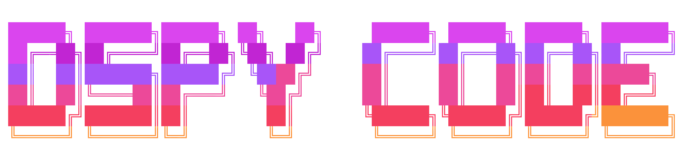

<div align="center">


<br/>



<br/>


<br/>

### 🚀 Your AI-Powered DSPy Development Assistant

**Build, Optimize, and Deploy DSPy Applications with Natural Language. Think of it as Claude Code for DSPy**

[](https://www.python.org/downloads/)
[](https://opensource.org/licenses/MIT)
[](https://badge.fury.io/py/dspy-code)
[](https://github.com/SuperagenticAI/dspy-code)
[](https://github.com/SuperagenticAI/dspy-code/actions/workflows/ci.yml)
[](https://github.com/astral-sh/ruff)
[](https://github.com/pre-commit/pre-commit)

[📖 Documentation](https://superagenticai.github.io/dspy-code/) •
[🚀 Quick Start](#-quick-start) •
[💡 Examples](#-use-cases) •
[🤝 Contributing](CONTRIBUTING.md)

---

### ⚡ Claude Code for DSPy

```bash
pip install dspy-code
dspy-code
```

**Ask in natural language** → **Get working DSPy code** → **Optimize with GEPA** → **Deploy**

</div>

> **💡 Note:** DSPy Code is in its **initial release** and under **active development**. The quality and effectiveness of generated code depends on several factors: the **language model** you connect, **MCP (Model Context Protocol) servers** you integrate, and the **context** you provide to DSPy Code. We're continuously improving based on community feedback.

---

## ✨ What is DSPy Code?

<div align="center">

**The First Purpose-Built CLI for DSPy Development**

</div>

DSPy Code is an **interactive development environment** that transforms how you learn and build with DSPy. Built as an intelligent CLI tool, it provides natural language interactions, code generation, optimization workflows, and comprehensive validation, all designed specifically for DSPy development.

> 💡 **Learn as you build.** doesn't matter, you're a complete beginner or a DSPy expert, the CLI adapts to your level and guides you through every step.

### 🎯 Perfect For:

| 🎓 **Learning DSPy** | 🚀 **Building Projects** | ⚡ **Optimizing Code** |
|---------------------|------------------------|----------------------|
| Interactive Q&A about DSPy concepts | Generate complete DSPy applications | Real GEPA optimization workflows |
| Built-in examples and templates | Natural language to code | Automated metric evaluation |
| Step-by-step guidance | Code validation & best practices | Progress tracking & resumption |

## 🎯 Why DSPy Code?

**"Why not just use Claude Code or Cursor, DeepWiki, CodeWiki with the DSPy repository?"**
While general AI assistants can help with DSPy, they lack the deep specialization that makes DSPy Code uniquely powerful:

### What Makes DSPy Code Special?

| **Generic AI Assistants** | **DSPy Code** |
|---------------------------|---------------|
| 📖 Generic coding help | 🎓 **DSPy-Native Intelligence** - Built-in knowledge of all 10 predictors, 11 optimizers, 4 adapters, and DSPy patterns |
| 🔄 Unaware of your setup | 📦 **Version-Aware** - Indexes YOUR installed DSPy version and generates compatible code |
| 💭 Code suggestions only | 🧬 **Real GEPA Execution** - Actually runs optimization workflows, not just code generation |
| 📁 Basic file reading | 📚 **Codebase RAG** - Deeply understands your entire project structure and patterns |
| ✏️ Syntax checking | ✅ **DSPy Validation** - Enforces signatures, modules, predictors, and best practices |
| 🤷 Generic workflows | ⚙️ **Complete Automation** - End-to-end workflows from `/init` to `/export` |
| 🔌 No tool integration | 🔗 **MCP Client Built-in** - Connect to external tools and services seamlessly |
| 📝 Start from scratch | 📋 **20+ Templates** - Pre-built patterns for RAG, QA, classification, and more |

### Real-World Impact

**Learning DSPy:**
- Generic AI: *Hours of reading docs, piecing together concepts*
- DSPy Code: *Ask "What is ChainOfThought?" → Get comprehensive answer with examples instantly*

**Building a RAG System:**
- Generic AI: *Days of manual setup, configuration, testing*
- DSPy Code: *`/init` → "Create a RAG system" → `/validate` → `/optimize` → Done in hours*

**Optimizing Code:**
- Generic AI: *Manual GEPA setup, metric functions, data formatting*
- DSPy Code: *`/optimize my_program.py` → Automated workflow with progress tracking*

### The Bottom Line

DSPy Code is a **purpose-built development environment** that embeds DSPy expertise into every interaction, automates tedious workflows, and accelerates your development from hours to minutes.


## 🎯 Key Features

- 🗣️ **Natural Language Interface** - Describe your DSPy task in plain English
- 🔗 **Built-in MCP Client** - Connect to any MCP server for external tools and services
- 🧠 **Version-Aware Intelligence** - Adapts to your installed DSPy version
- 🧬 **GEPA Optimization** - Real Genetic Prompt Evolution Algorithm integration
- 📚 **Codebase RAG** - Understands your project with intelligent indexing
- ✅ **Smart Validation** - Ensures code follows DSPy best practices
- 🚀 **Code Generation** - Generate signatures, modules, and complete programs
- 💾 **Session Management** - Save and resume your work across sessions
- 📦 **Export/Import** - Package and share your DSPy projects

## 🚀 Quick Start

### Installation

**⚠️ CRITICAL: Always create your virtual environment INSIDE your project directory!**

```bash
# 1. Create a project directory
mkdir my-dspy-project
cd my-dspy-project

# 2. Create virtual environment IN this directory (not elsewhere!)
python -m venv .venv

# 3. Activate it
source .venv/bin/activate  # On Windows: .venv\Scripts\activate

# 4. Install dspy-code (installs into .venv/ in your project)
pip install dspy-code

# 5. Run dspy-code (everything stays in this directory!)
dspy-code
```

**Why virtual environment IN your project directory?**
- 🔒 **Security**: All file scanning stays within your project directory
- 📦 **Isolation**: Your project dependencies are self-contained
- 🚀 **Portability**: Share your project by zipping the entire directory
- 🎯 **Simplicity**: Everything in one place - no scattered files
- 🧹 **Clean**: Delete the project folder to remove everything

### Project Structure

When you follow this setup, your project will be fully self-contained:

```
my-dspy-project/          # Your CWD
├── .venv/                # Virtual environment (packages installed here)
├── .dspy_cache/          # DSPy's LLM response cache
├── .dspy_code/           # dspy-code's internal data
│   ├── cache/            # RAG index cache
│   ├── sessions/         # Session state
│   ├── optimization/     # GEPA workflow data
│   └── history.txt       # Command history
├── generated/            # Your generated code
├── modules/              # Your modules
├── signatures/           # Your signatures
└── dspy_config.yaml      # Your config
```

**Everything in one directory!** Delete the folder, and it's all gone. Zip it, and share with others.

**Never run dspy-code from:**
- ❌ Your home directory (`~/`)
- ❌ Desktop, Documents, Downloads, or Pictures folders
- ❌ System directories
- ❌ With a virtual environment outside your project

**Never do this:**
```bash
# ❌ DON'T: Virtual env outside project
cd ~/
python -m venv my_global_venv

# ❌ DON'T: System-wide installation
pip install dspy-code
```

### Your First Program (5 minutes)

```bash
# From your project directory with activated venv:
dspy-code

# Initialize your project (creates config and scans your environment)
/init

# Connect to a model (example with Ollama)
/connect ollama llama3.1:8b

# Generate your first program using natural language
Create a sentiment analyzer that takes text and outputs positive or negative

# Save the generated code
/save sentiment.py

# Validate and run
/validate
/run
```

**That's it!** You just created, validated, and ran your first DSPy program. 🎉

## 📋 Available Commands

DSPy Code is **interactive-only** - all commands are slash commands. Here are the main categories:

### 🏁 Getting Started
- `/init` - Initialize or scan your DSPy project
- `/intro` - Show introduction and getting started guide
- `/help` - Show all available commands
- `/exit` - Exit the interactive session

### 🤖 Model Connection
- `/connect <provider> <model>` - Connect to LLM (ollama, openai, anthropic, gemini)
- `/disconnect` - Disconnect current model
- `/models` - List available models
- `/status` - Show current connection status

### 💻 Code Generation & Management
- `/demo` - Generate demo DSPy code
- `/save <filename>` - Save generated code to file
- `/validate` - Validate DSPy code
- `/run` - Execute your DSPy program
- `/test` - Run tests on your code

### 🧬 Optimization
- `/optimize` - Start optimization workflow
- `/optimize-start` - Begin GEPA optimization
- `/optimize-status` - Check optimization progress
- `/optimize-cancel` - Cancel running optimization
- `/optimize-resume` - Resume paused optimization
- `/eval` - Evaluate your DSPy program

### 🔗 MCP Integration
- `/mcp-connect <server>` - Connect to MCP server
- `/mcp-disconnect <server>` - Disconnect MCP server
- `/mcp-servers` - List configured MCP servers
- `/mcp-tools` - Show available MCP tools
- `/mcp-call <tool> <args>` - Call an MCP tool
- `/mcp-resources` - List MCP resources
- `/mcp-read <resource>` - Read MCP resource
- `/mcp-prompts` - List MCP prompts
- `/mcp-prompt <name>` - Get MCP prompt

### 💾 Session Management
- `/sessions` - List all saved sessions
- `/session <name>` - Load or switch session

### 📦 Export & Import
- `/export <path>` - Export project as package
- `/import <path>` - Import project package

### 📚 Reference & Examples
- `/reference <topic>` - Get DSPy reference documentation
- `/examples` - Show example DSPy programs
- `/predictors` - Show available DSPy predictors
- `/adapters` - Show DSPy adapters
- `/retrievers` - Show DSPy retrievers
- `/async` - Show async patterns
- `/streaming` - Show streaming examples
- `/data` - Show data handling examples
- `/explain <concept>` - Explain DSPy concepts

### 🔧 Project Management
- `/project` - Show project information
- `/refresh-index` - Rebuild codebase index
- `/index-status` - Show index status
- `/save-data` - Save training/evaluation data

### 🗂️ History & Context
- `/history` - Show conversation history
- `/clear` - Clear current context

## 💡 Use Cases

### 🆕 Starting a New DSPy Project
```bash
dspy-code
/init
/connect ollama llama3.1:8b
Create a RAG system for document Q&A
/save rag_system.py
```

### 🔧 Optimizing Existing Code
```bash
dspy-code
/init
/optimize-start my_module.py training_data.jsonl
/optimize-status
```

### 🔗 Using MCP for External Tools
```bash
dspy-code
/mcp-connect filesystem
/mcp-tools
/mcp-call read_file {"path": "data.json"}
```

### 📖 Learning DSPy
```bash
dspy-code
/intro
/examples
/explain ChainOfThought
/predictors
```

## 🔌 Model Connection

Connect to any LLM provider:

```bash
# Ollama (local, free)
/connect ollama llama3.1:8b

# OpenAI
/connect openai gpt-4

# Anthropic
/connect anthropic claude-3-5-sonnet-20241022

# Google Gemini
/connect gemini gemini-2.0-flash-exp
```

## 🧬 GEPA Optimization

DSPy Code includes real Genetic Prompt Evolution Algorithm optimization:

```bash
# Start optimization workflow
/optimize my_program.py training_data.jsonl

# Or use step-by-step optimization
/optimize-start my_program.py training_data.jsonl
/optimize-status
/optimize-resume
```

## 📋 Requirements

- **Python**: 3.10 or higher
- **DSPy**: 3.0.4 or higher (automatically installed)
- **Dependencies**: All dependencies are automatically installed

## 🛠️ Installation Options

### From PyPI (Recommended)

```bash
pip install dspy-code
```

### From Source

```bash
git clone https://github.com/SuperagenticAI/dspy-code.git
cd dspy-code
pip install -e .
```

### With uv (Faster)

```bash
uv pip install dspy-code
```

## 🏗️ Architecture

DSPy Code is built with a modular architecture:

- **Commands** - Interactive slash commands
- **Models** - LLM connection and code generation
- **MCP** - Model Context Protocol client
- **Optimization** - GEPA workflow management
- **Validation** - Code quality and best practices
- **RAG** - Codebase indexing and search
- **Execution** - Sandboxed code execution
- **Session** - State management
- **Export** - Project packaging

## 📚 Documentation

**Full documentation available at:** [https://superagenticai.github.io/dspy-code/](https://superagenticai.github.io/dspy-code/)

### Quick Links

- [📦 Installation Guide](https://superagenticai.github.io/dspy-code/getting-started/installation/)
- [⚡ Quick Start](https://superagenticai.github.io/dspy-code/getting-started/quick-start/)
- [💬 Interactive Mode](https://superagenticai.github.io/dspy-code/guide/interactive-mode/)
- [⌨️ Slash Commands](https://superagenticai.github.io/dspy-code/guide/slash-commands/)
- [🔗 MCP Integration](https://superagenticai.github.io/dspy-code/advanced/mcp-integration/)
- [🎯 Optimization Guide](https://superagenticai.github.io/dspy-code/guide/optimization/)

## 🤝 Contributing

Contributions are welcome! We follow modern Python best practices:

- **Code Quality**: Ruff for linting and formatting
- **Testing**: pytest with coverage
- **CI/CD**: GitHub Actions
- **Pre-commit**: Automated quality checks

See [CONTRIBUTING.md](CONTRIBUTING.md) for detailed guidelines.

### Quick Development Setup

```bash
git clone https://github.com/SuperagenticAI/dspy-code.git
cd dspy-code

# Using uv (recommended)
uv venv
source .venv/bin/activate
uv pip install -e ".[dev,test,docs]"
pre-commit install

# Or using pip
python -m venv .venv
source .venv/bin/activate
pip install -e ".[dev,test,docs]"
pre-commit install

# Run tests
pytest

# Run linting
ruff check .

# Format code
ruff format .
```

## 📄 License

This project is licensed under the MIT License - see the [LICENSE](LICENSE) file for details.

## ⚠️ Development Status

DSPy Code is currently in **Beta** and under active development. While it's functional and ready for experimentation, it's **not yet production-ready**. We're actively adding features to make it production-worthy so you can use it in real projects to enhance your workflow.

**We'd love your feedback!** Try it out, share your experience, and help us shape the future of DSPy development:

- 🐛 [Report issues](https://github.com/SuperagenticAI/dspy-code/issues)
- ⭐ [Star the repo](https://github.com/SuperagenticAI/dspy-code) to show your support

## 🙏 Acknowledgments

<div align="center">

Built with ❤️ by **[Superagentic AI](https://super-agentic.ai)**

Special thanks to the DSPy community and all contributors!

</div>

---

<div align="center">

### 📚 Resources

**[📖 Documentation](https://superagenticai.github.io/dspy-code/)** •
**[🐛 Issues](https://github.com/SuperagenticAI/dspy-code/issues)** •
**[🤝 Contributing](CONTRIBUTING.md)**

---

### ⭐ Show Your Support

If DSPy Code helps your workflow, give us a star! ⭐

It helps others discover the project and motivates us to keep improving it.

---


**Made with 💜 for the DSPy community**

</div>
